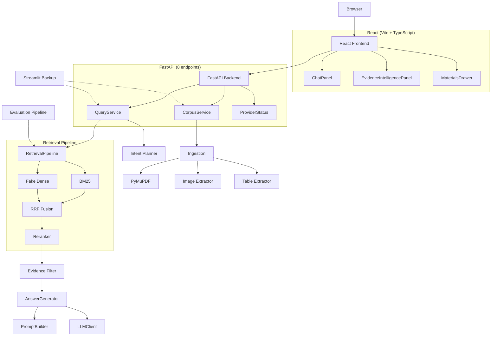
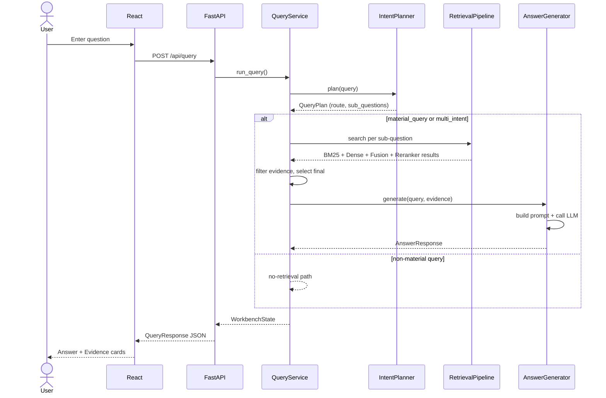
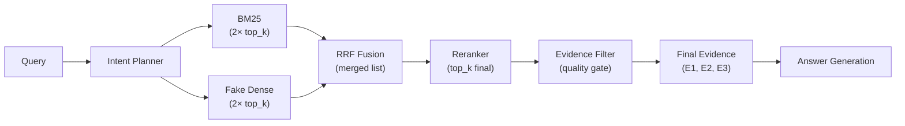

# System Architecture

## Evidence-Grounded RAG Study Assistant

### 1. Architecture Overview

The system follows a layered architecture:

- **React + Vite + TypeScript frontend** — product UI with two-column layout, communicating exclusively through JSON HTTP endpoints
- **FastAPI backend** — thin adapter layer (8 endpoints) over the RAG service
- **App Services layer** — `QueryService` (pipeline orchestration), `CorpusService` (document management), `ProviderStatus` (provider reporting)
- **RAG Core** — retrieval pipeline (BM25 / Dense / Fusion / Reranker), answer generation, intent planning, and evidence filtering
- **Ingestion layer** — PyMuPDF-based PDF parsing with text, image, and table extraction
- **Streamlit backup** — preserved `app/streamlit_app.py` importing the same services

### 2. System Architecture Diagram



### 3. Query Pipeline Sequence



### 4. Retrieval Pipeline



| Stage | Input | Output | Method |
|---|---|---|---|
| BM25 | Query tokens | 2×top_k chunks | Okapi BM25 (k1, b tuned) |
| Dense | Query string | 2×top_k chunks | SHA256 hashing + cosine similarity |
| Fusion | BM25 + Dense rankings | Merged ranked list | RRF (`1/(k+rank)`, k=60) |
| Reranker | Fusion candidates + query | Reranked top_k | Mock heuristic / SiliconFlow API |
| Evidence Filter | Reranked top_k | Valid evidence | Placeholder detection, type preference |
| Final Evidence | Filtered evidence | E1, E2, E3 | Cap: 5 total, 1 per sub-question |

### 5. Data Schema / Response Contract

`POST /api/query` returns the following structure:

```json
{
  "query": "What is overfitting?",
  "answer": {
    "text": "Based on the course material, overfitting occurs when... [E1].",
    "grounding_status": "grounded",
    "generation_mode": "mock",
    "retrieval_explanation": "Top 3 reranked evidence chunks were selected..."
  },
  "citations": [
    { "evidence_id": "E1", "chunk_id": "doc001_page003_text_0001", "source_file": "lecture.pdf", "page": 3 }
  ],
  "final_evidence": [
    { "evidence_id": "E1", "source_file": "lecture.pdf", "page": 3, "type": "text", "method": "reranked", "preview": "Overfitting occurs when...", "support_label": "supported" }
  ],
  "retrieval_trace": [
    { "stage": "BM25", "result_count": 6, "latency_ms": 3 },
    { "stage": "Dense", "result_count": 6, "latency_ms": 4 },
    { "stage": "Fusion", "result_count": 6, "latency_ms": 2 },
    { "stage": "Reranker", "result_count": 3, "latency_ms": 5 },
    { "stage": "Final Evidence", "result_count": 2, "latency_ms": 0 }
  ],
  "retrieval": { "bm25": [...], "dense": [...], "fusion": [...], "reranked": [...] },
  "query_plan": { "original_query": "...", "is_multi_intent": false, "sub_questions": [...] },
  "sub_question_support": [{ "id": "Q1", "question": "...", "support_label": "supported", "evidence_ids": ["E1"] }],
  "support_label": "supported",
  "timing": { "bm25": 3, "dense": 4, "fusion": 2, "reranker": 5, "generation": 12, "total": 90 },
  "scope": { "corpus_name": "Sample corpus", "chunk_count": 28 }
}
```

Key design choices in the response contract:
- `final_evidence[].preview` is a cleaned, sentence-boundary excerpt — not a hard mid-word cut.
- `final_evidence[].image_url` and `final_evidence[].table_summary` are optional display helpers.
- `retrieval_trace[].confidence` provides method-relative match strength (not cross-method comparable).
- Raw internal identifiers (`chunk_id`, `doc_id`) are present in `citations` and `final_evidence` for citation resolution but hidden from user-facing UI in a collapsible "Developer details" section.
- `generation_mode` labels answer provenance: `mock` (offline deterministic), `llm` (real API), `fallback` (API failed, mock used), `none` (no-evidence response).

### 6. Evidence Quality Gate

The evidence quality gate operates at three levels:

**Table placeholder detection** (`_is_noisy_table_content`):
- Detects captions matching "Table extracted from PDF."
- Identifies content dominated by repeated separators (`|||||`) or box-drawing characters.
- Checks character ratios — tables with <5% alphabetic content and no CJK/digits are flagged.
- Detects internal identifiers (`chunk_id`, `doc_id`, hash patterns) in chunk text.

**Evidence type preference** (`_rank_sub_question_candidates`):
- Text and image chunks receive a positive type bonus in ranking.
- Valid table chunks receive a neutral or negative type score unless the query explicitly mentions tables, numerical data, comparisons, columns, rows, or formulas.
- Invalid table chunks are pushed to the bottom of the candidate list.

**Final evidence capping** (`_select_final_evidence`):
- Global cap of 5 evidence cards; per-sub-question cap of 1 card for multi-intent queries.
- Deduplication by `chunk_id`, or by `source_file/page/preview` when chunk IDs are unavailable.
- Invalid tables are preserved in the full candidate list (visible in method diagnostics) but excluded from the user-facing E1/E2/E3 cited evidence cards.

**Image evidence fallback**:
- When `image_url` is available, the evidence card renders a thumbnail with a loading failure handler.
- When the image is unavailable or fails to load, the card shows a graceful fallback with caption or nearby text.
- Image loading failures never break the page layout.

**Text cleaning pipeline**:
- Consecutive vertical bars (`|||||`) and Unicode box-drawing characters are replaced with spaces.
- Hash-like strings (32+ or 40+ hex characters) are replaced with `[hash]`.
- Internal identifier patterns (`page_NNN_text_NNNN`, `chunk_id`, `doc_id`) are removed from display text.
- Sentence-boundary truncation prevents mid-word cuts in evidence previews.

### 7. PDF Open Page Design

Evidence cards display an "Open page" link for registered PDF sources. The design avoids `file://` protocol and local path exposure:

```
Evidence Card                         Browser (new tab)
┌─────────────────────────┐           ┌──────────────────────┐
│ E1  reranked  supported │           │ PDF Viewer           │
│ lecture.pdf  page 3     │  click    │                      │
│ [Open page] ──────────────────────→ │ ── page 3 visible ── │
│ Overfitting occurs...   │           │                      │
└─────────────────────────┘           └──────────────────────┘
```

Implementation:
1. Frontend renders `<a href="/api/documents/{doc_id}/file#page={page}" target="_blank">`.
2. Backend `GET /api/documents/{doc_id}/file`:
   - Looks up `doc_id` in the document registry.
   - Validates the stored file path is within the configured upload directory (path traversal prevention).
   - Returns the PDF with inline Content-Disposition for browser viewing.
   - Returns 403 for path traversal attempts, 404 for missing documents, 400 for non-PDF files.
3. The `#page={page}` fragment is handled by the browser's built-in PDF viewer.

No `stored_path`, `chunk_cache_path`, or other internal filesystem paths are exposed to the client.

### 8. Provider Factory Pattern

```python
create_llm_client(config)             → MockLLMClient | SiliconFlowLLMClient
create_reranker_client(config)        → MockRerankerClient | SiliconFlowRerankerClient
create_intent_planner(config)         → DeterministicIntentPlanner | SiliconFlowIntentPlanner
create_vision_caption_client(config)  → MockVisionCaptionClient | SiliconFlowVisionCaptionClient
```

Fallback logic:
1. `APP_MODE=local` → always mock (no network, GPU, or API keys)
2. `APP_MODE=api` + valid key + network → real provider
3. `APP_MODE=api` + missing key / network error / parse error → mock fallback with warning

### 9. Security

- **Prompt injection protection**: Retrieved context is marked as untrusted reference material before being included in LLM prompts
- **No API key exposure**: `.env` is git-ignored; `safe_runtime_status()` returns `SILICONFLOW_API_KEY=set` or `missing` only
- **Path traversal prevention**: PDF file endpoint validates paths against the configured upload directory
- **Evidence grounding**: LLM constrained to top-K evidence; insufficient evidence triggers refusal, not hallucination
