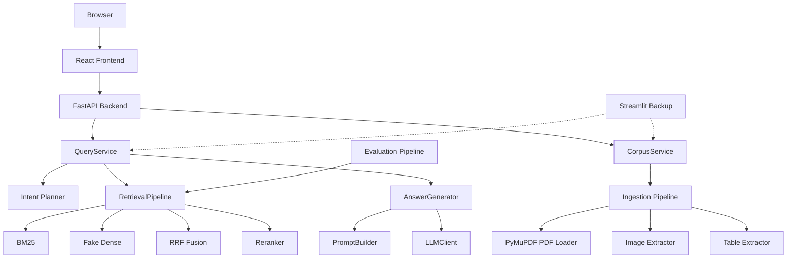
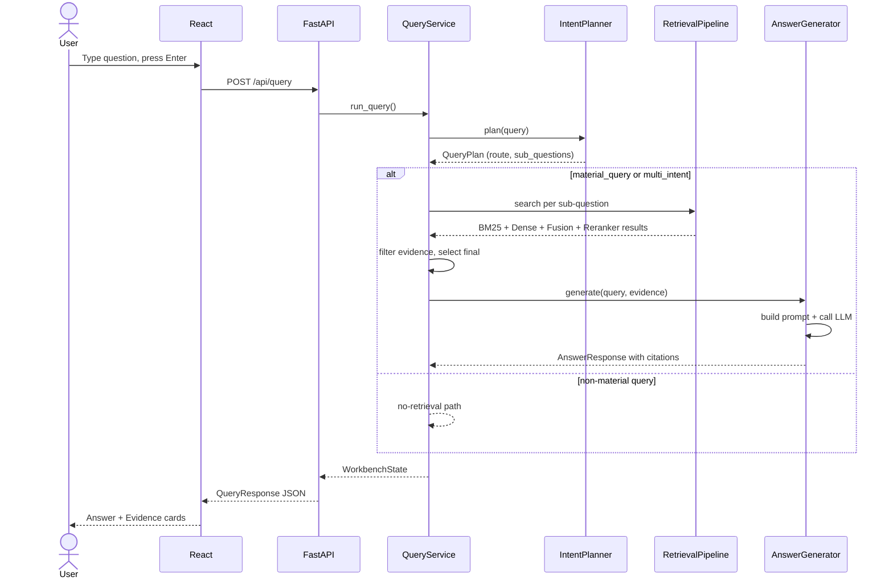
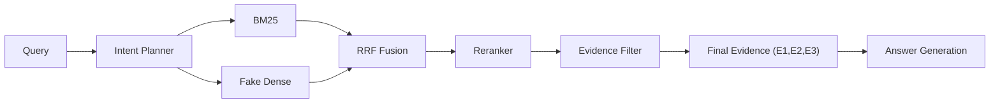

# System Architecture

## Evidence-Grounded RAG Study Assistant

### 1. High-Level Architecture



The React frontend communicates with FastAPI through JSON HTTP endpoints. FastAPI delegates all RAG logic to the App Services layer. `QueryService` orchestrates the full pipeline. `CorpusService` manages document upload, registry, and chunk caching. The Streamlit backup imports the same services, ensuring feature parity.

### 2. Query Pipeline Sequence



### 3. Retrieval Flow



| Stage | Input | Output | Approach |
|---|---|---|---|
| BM25 | Query tokens | Top 2×top_k chunks | TF-IDF + Okapi BM25 |
| Dense | Query string | Top 2×top_k chunks | SHA256 hashing + cosine similarity |
| Fusion | BM25 + Dense results | Merged ranked list | Reciprocal Rank Fusion (k=60) |
| Reranker | Fusion candidates + query | Reranked top_k | Mock heuristic / SiliconFlow API |
| Final Evidence | Reranked top_k, filtered | E1, E2, E3 | Type-preference + table quality check |

### 4. React Component Tree

```
App.tsx
 ├── ChatPanel.tsx
 │    ├── CitationText.tsx     (renders clickable [E1] anchors)
 │    └── MaterialsDrawer.tsx  (upload, scope, doc list)
 └── EvidenceIntelligencePanel.tsx
      ├── EvidenceCards.tsx    (E1/E2/E3 cards with metadata)
      ├── RetrievalFlow.tsx    (stage-by-stage flow visualization)
      ├── MethodAnalysis.tsx   (per-method rows + PerQueryAnalysis)
      └── MethodGuide.tsx      (educational method explanations)
```

### 5. Backend Module Organization

```
src/rag_project/
├── api/main.py              FastAPI app factory (8 endpoints)
├── app_services/
│   ├── query_service.py     Full query orchestration
│   ├── corpus_service.py    Document upload, registry, corpus loading
│   └── provider_status.py   Provider configuration reporting
├── retrieval/
│   ├── bm25_retriever.py    Pure Python BM25
│   ├── dense_retriever.py   Fake deterministic dense retrieval
│   ├── fusion.py            RRF fusion implementation
│   ├── reranker.py          Reranker interface + MockRerankerClient
│   ├── siliconflow_reranker.py  SiliconFlow API reranker
│   ├── pipeline.py          RetrievalPipeline orchestrator
│   └── tokenization.py      Tokenizer for BM25 indexing
├── generation/
│   ├── prompt_builder.py    Safety-conscious prompt construction
│   ├── llm_client.py        LLMClient interface + MockLLMClient
│   ├── siliconflow_client.py   SiliconFlow API LLM client
│   └── answer_generator.py  AnswerGenerator (evidence → grounded answer)
├── query_planning/
│   ├── intent_planner.py    DeterministicIntentPlanner
│   └── siliconflow_intent_planner.py  SiliconFlow API planner
├── ingestion/
│   ├── pdf_loader.py        PyMuPDF text+image+table extraction
│   ├── text_loader.py       Plain text / markdown loader
│   ├── image_extractor.py   PDF embedded image extraction
│   ├── table_extractor.py   Lightweight table detection
│   └── chunker.py           Text splitting with metadata
├── evaluation/              Offline evaluation pipeline
├── config.py                Environment-driven AppConfig
├── providers.py             Provider factory functions
└── schemas.py               Core Pydantic data models
```

### 6. Provider Factory Pattern

```python
create_llm_client(config)          → MockLLMClient | SiliconFlowLLMClient
create_reranker_client(config)     → MockRerankerClient | SiliconFlowRerankerClient
create_intent_planner(config)      → DeterministicIntentPlanner | SiliconFlowIntentPlanner
create_vision_caption_client(config) → MockVisionCaptionClient | SiliconFlowVisionCaptionClient
```

**Fallback logic:**
1. `APP_MODE=local` → always mock (zero network)
2. `APP_MODE=api` + key present + network → real provider
3. `APP_MODE=api` + missing key / network error / parse error → mock fallback

### 7. Data Flow: Ingestion

```
PDF Upload → PyMuPDF extraction
  ├── Text extraction → Chunker → text chunks
  ├── Image extraction → save to disk → image chunks (caption + nearby_text)
  └── Table detection → HTML/markdown → table chunks
→ Chunk cache saved to data/processed/chunks/
→ Document registered in data/processed/corpus_registry.json
```

### 8. Security

- **Prompt injection protection**: Retrieved context explicitly marked as untrusted reference material
- **No API key exposure**: `.env` git-ignored; `safe_runtime_status()` returns `set`/`missing` only
- **Path traversal prevention**: `GET /api/documents/{doc_id}/file` validates against configured upload directory
- **Evidence grounding**: LLM constrained to top-K evidence; insufficient evidence → refusal, not hallucination
- **Public payloads**: `stored_path` and `chunk_cache_path` stripped from document responses
